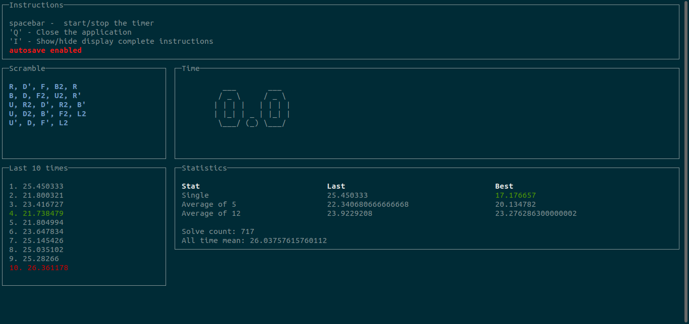
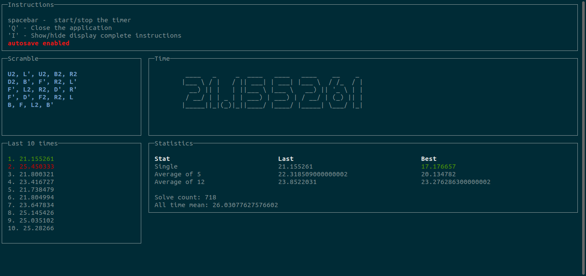
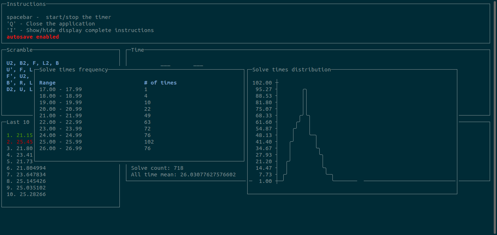
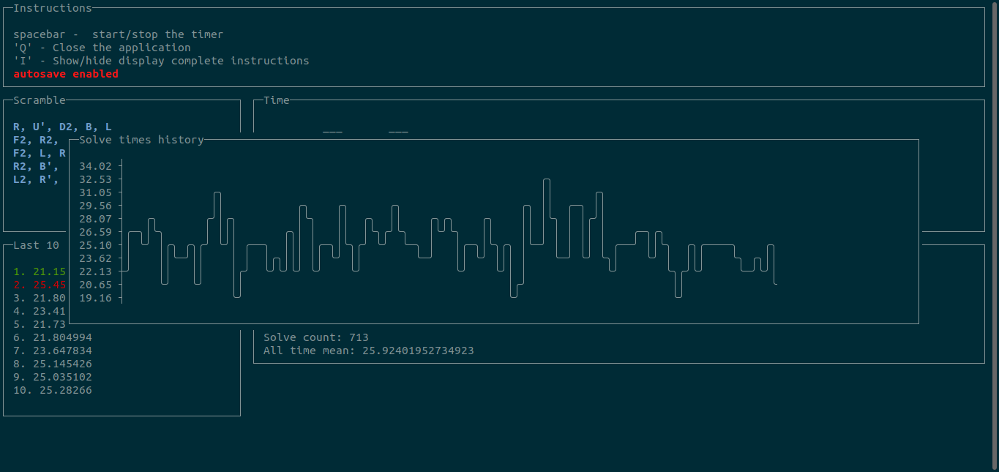
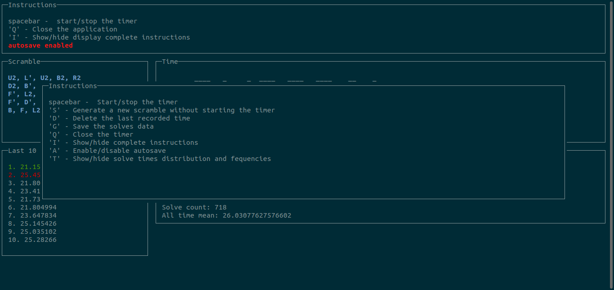

# Elixir Rubik's cube timer



This is a Rubik's cube timer for the command line implemented in Elixir.

## Features

* Time your solves. Press the spacebar to start/stop the timer.

* Generate scrambles for 3x3x3. You get an initial scramble. `S` generates a new scramble without starting the timer
* Delete latest solve. Press `D` to delete the latest recorded solve.
* Store your solve data. If autosaved enabled, this is updated upon solve completion/deletion. If not, you can save by pressing `G`. Or press `A` to enable/disable autosave.
* A few solve statistics:
  * Best/last single
  * Best/last average of five
  * Best/last average of 12
  * Solve count
  * All time mean
  * Solve times distribution and frequencies. Press `T` to show 
  * Chart with times for the latest 100 solves. Press `H` to show 
* Press `I` to display complete instructions 

## Upcoming features

* Allow to hide timer while solving
* Support for other puzzles and subsets
* Import/export times
* Preferences configuration (timer with big text or regular text, hide while solving, autosave, etc.)

## Running locally

Clone the project:

```bash
$ git clone https://github.com/sbacarob/cli-rubiks.git
```

Go into the project and fetch dependencies

```bash
$ cd cli-rubiks
$ mix deps.get
```

Run the application

```bash
$ mix run lib/rubiks_timer.ex
```

or

```bash
$ iex -S mix
```